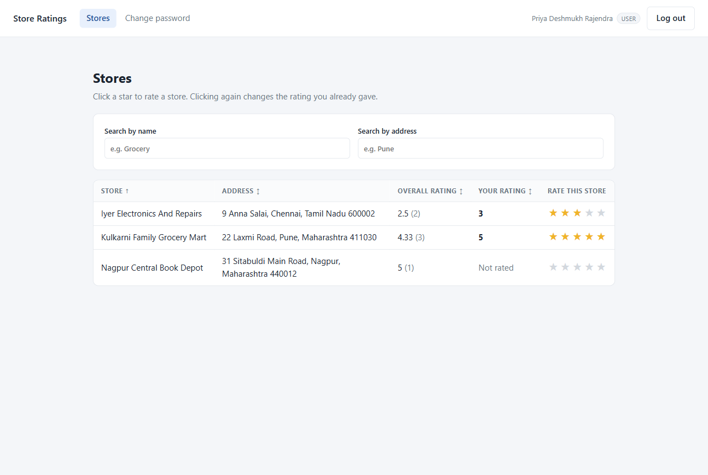
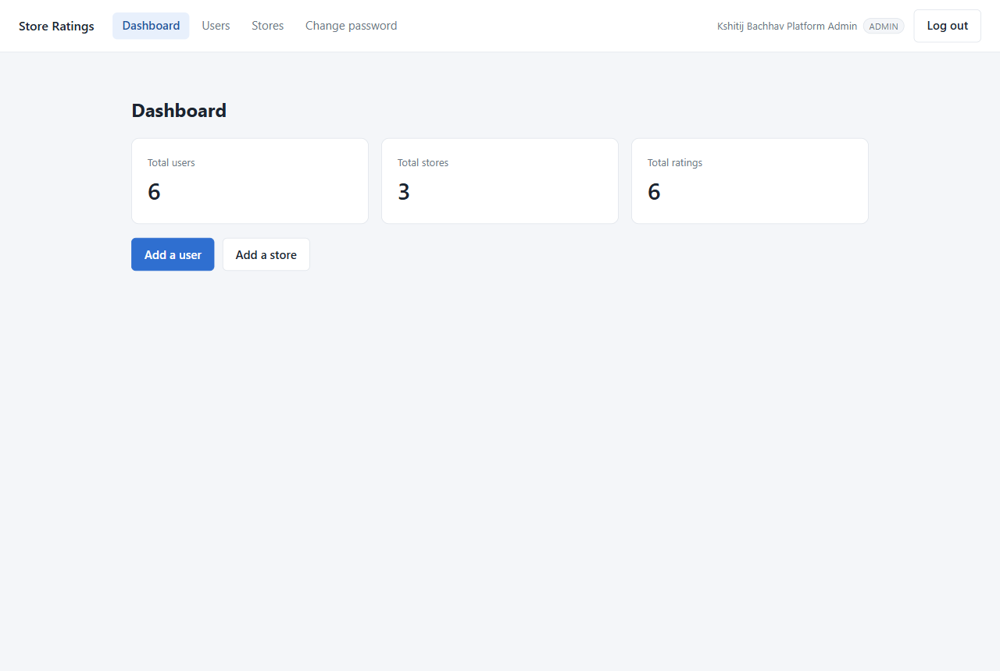
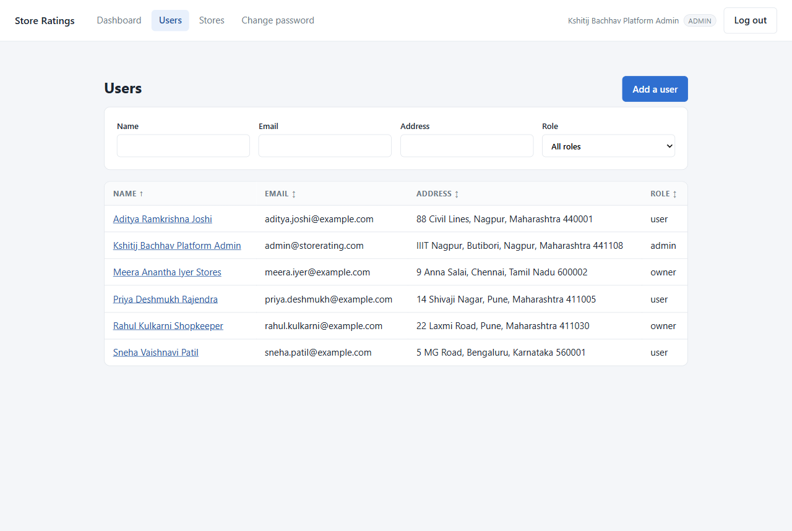
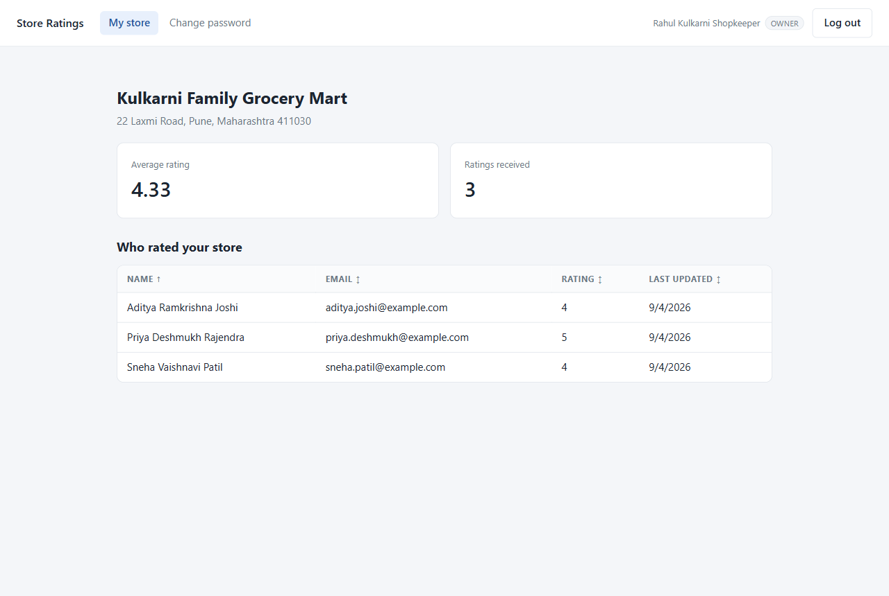
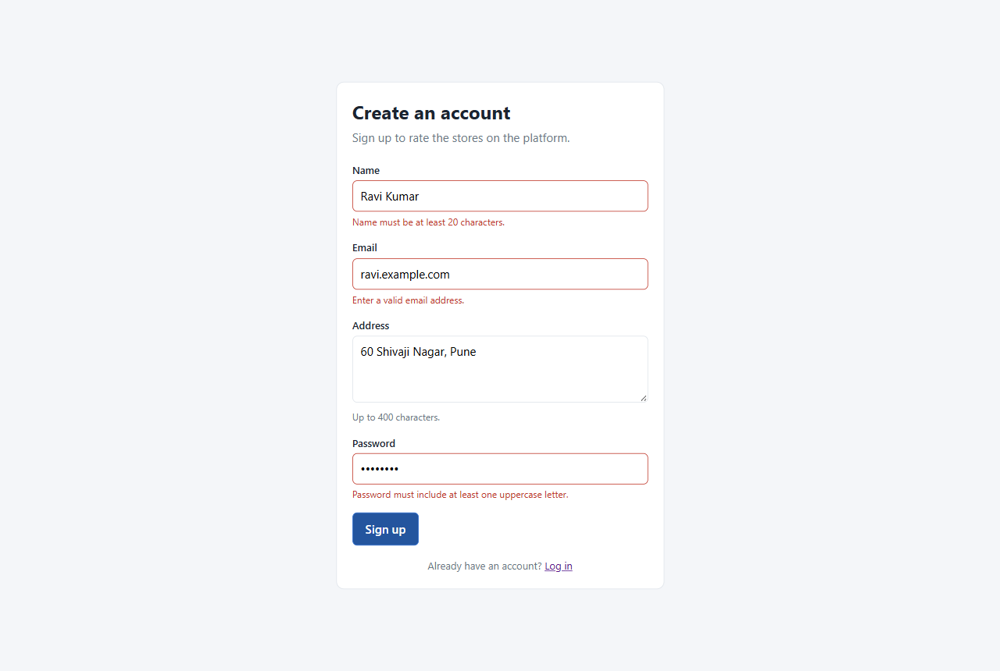

# Store Rating App

A web app where users rate stores from 1 to 5. One login page serves all three roles, and each
role sees a different set of screens after signing in.

Built for the FullStack Intern Coding Challenge.

## Tech stack

- **Backend:** Express (Node.js), plain SQL via `pg`
- **Database:** PostgreSQL 16
- **Frontend:** React (Vite)
- **Auth:** JWT in an `Authorization: Bearer` header, passwords hashed with bcrypt

## Roles

| Role | What they can do |
|------|------------------|
| Admin | Add stores and users, see totals for users/stores/ratings, browse and filter every list |
| Normal user | Sign up, browse and search stores, submit and change their rating |
| Store owner | See who rated their store and their average rating |

## Screenshots

**Normal user — browse, search and rate stores.** Each row shows the overall average, the number
of ratings behind it, and the rating this user gave. Clicking a star submits or changes it.



**Admin — dashboard and user management.** The lists filter on name, email, address and role, and
every key column sorts.





**Store owner — who rated my store.** Average rating, how many ratings it is based on, and the
list of raters.



**Form validation.** Every rule is checked in the browser for quick feedback and again on the
server, which is the one that decides.



## Running it locally

You need Node 18+ and Docker (for the database).

```bash
# 1. start postgres
docker compose up -d

# 2. backend
cd backend
cp .env.example .env
npm install
npm run db:setup      # creates the tables and seeds demo accounts
npm run dev           # http://localhost:4200

# 3. frontend, in a second terminal
cd frontend
npm install
npm run dev           # http://localhost:5180
```

If you already have PostgreSQL running locally, skip Docker and point `DATABASE_URL` in
`backend/.env` at your own database instead.

## Demo accounts

`npm run db:setup` seeds one account per role. All of them use the password `Password@123`.

| Role | Email |
|------|-------|
| Admin | admin@storerating.com |
| Normal user | priya.deshmukh@example.com |
| Store owner | rahul.kulkarni@example.com |

## Form rules

These come from the challenge brief and are checked in the browser and again on the server.

- **Name** — 20 to 60 characters
- **Address** — up to 400 characters
- **Password** — 8 to 16 characters, at least one uppercase letter and one special character
- **Email** — standard email format
- **Rating** — a whole number from 1 to 5

## Project layout

```
backend/
  src/
    routes/       one file per area: auth, stores, admin, owner
    middleware/   login check and role check
    db/           schema.sql and the seed script
frontend/
  src/
    pages/        one file per screen
    components/   shared pieces, e.g. the sortable table
```

## Notes on the design

- A rating is one row per (user, store) pair with a unique constraint, so "change my rating" is
  an `UPDATE` and a user can never rate the same store twice.
- The store list returns the overall average and the signed-in user's own rating in the same
  query, so the page does not need a follow-up request per store.
- Sorting and filtering happen in SQL against a whitelist of column names, not by string
  concatenation of whatever the client sends.
